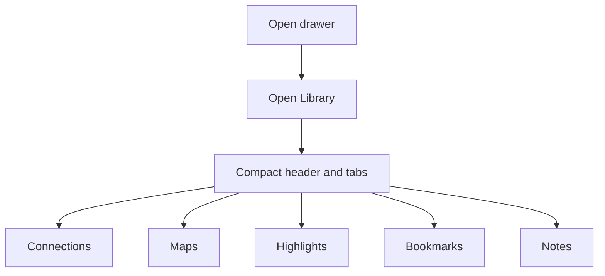
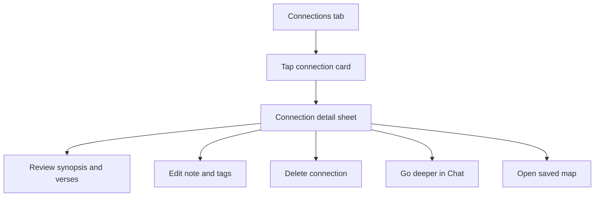
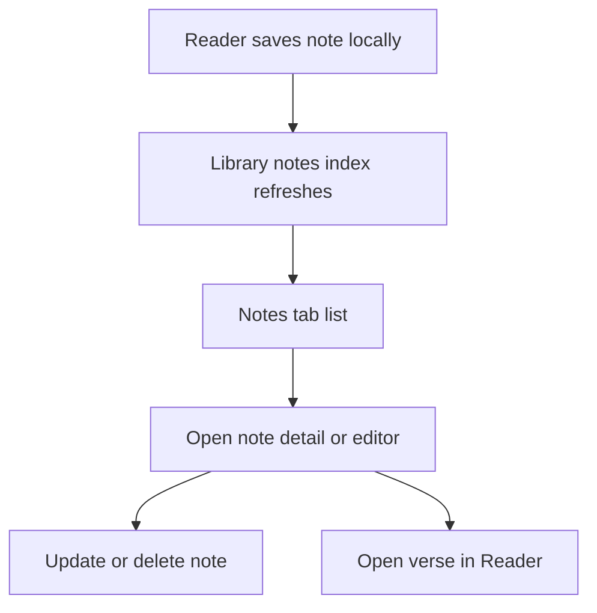

# Library Mobile Parity Deliverable

Last updated: 2026-03-10

## Mission

Make the native Library experience as clean and complete as the web Library while preserving native presentation patterns.

## Agent Roster

- Mobile UX Expert
- Mobile UI Expert
- Web UI/UX Source-of-Truth Expert
- Web Logic and Pipeline Source-of-Truth Expert

## Scope and Code Sources

### Web UI and UX source files

- `apps/web/src/components/LibraryView.tsx`
- `apps/web/src/components/golden-thread/SemanticConnectionModal.tsx`
- `apps/web/src/contexts/BibleBookmarksContext.tsx`
- `apps/web/src/contexts/BibleHighlightsContext.tsx`
- `apps/web/src/hooks/useBibleNotes.ts`

### Web logic and pipeline source files

- `apps/web/src/lib/libraryApi.ts`
- `packages/shared-client/src/api/createProtectedApiClient.ts`
- `apps/api/src/routes/library.ts`
- `apps/api/src/routes/bookmarks.ts`
- `apps/api/src/routes/highlights.ts`

### Mobile implementation files

- `apps/mobile/src/screens/DataListScreens.tsx`
- `apps/mobile/src/screens/common/EntityCards.tsx`
- `apps/mobile/src/screens/DetailScreens.tsx`
- `apps/mobile/src/screens/ReaderScreen.tsx`
- `apps/mobile/src/hooks/useMobileAppController.ts`
- `apps/mobile/src/lib/api.ts`
- `apps/mobile/src/navigation/MobileRootNavigator.tsx`

---

## Step 1 - Codebase Review

## Agent 1 - Mobile UX Expert

### Screen and component inventory

- `LibraryScreen` is the top-level Library workspace with five chip modes: Connections, Maps, Bookmarks, Highlights, Notes.
- `BookmarksScreen` and `HighlightsScreen` are embedded sublists reused both inside Library and in the separate Saved route.
- `BookmarkCreateScreen`, `BookmarkDetailScreen`, `HighlightCreateScreen`, and `HighlightDetailScreen` live as separate stack routes.
- `LibraryMapCreateScreen` is a separate route that requires a manual bundle ID.
- `ConnectionCard`, `LibraryMapCard`, `BookmarkCard`, and `HighlightCard` are the primary entity surfaces.
- Reader notes already exist in `ReaderScreen` via `READER_VERSE_NOTES_STORAGE_KEY`, but Library never indexes or renders them.

### Current mobile interaction and flow

1. Drawer -> Library -> choose mode chip.
2. Connections tab -> search -> card actions are limited to `Go deeper` and `Open map`.
3. Maps tab -> search -> create map from manual bundle ID -> open or delete map.
4. Bookmarks tab -> tap card -> separate detail route -> open in reader or delete.
5. Highlights tab -> tap card -> separate detail route -> edit color and note, open in reader, or delete.
6. Notes tab -> placeholder only.

### Gap list vs intended experience

1. Library is not a unified continuation hub; users bounce into separate CRUD routes for bookmarks and highlights instead of staying in one clean workspace.
2. Connections have no detail state on mobile, so synopsis review, note and tag editing, and delete behavior are missing.
3. Notes parity is absent even though note data already exists in reader storage.
4. Map creation is library-internal and manual, while web save flows are contextual from discovery and map surfaces.
5. Cross-entity continuity is inconsistent. Connections can open chat or map, but bookmarks and highlights cannot continue into chat or insight flows from the list itself.
6. The Library shell requires too much top-of-screen chrome before content starts.

## Agent 2 - Mobile UI Expert

### Screen and component inventory

- `SurfaceCard` wraps nearly every library header and section.
- `PressableScale`, `ActionButton`, `SearchInput`, and `StatCard` define the current control language.
- Library lists use `FlatList` with per-tab headers plus per-entity cards and skeletons.

### Current visual and interaction model

1. The shell is card-first, with stacked header cards and chip rows before the first item.
2. Connections, maps, bookmarks, and highlights each use different card emphasis and action density.
3. Bookmarks and highlights rely on long-press quick actions in-list, then expand into separate detail screens for the fuller edit flow.
4. Notes is visually presented as a real mode even though it is only an empty placeholder.

### Gap list vs intended experience

1. Mobile Library reads like four separate utility screens, not one coherent workspace.
2. The chip row is visually heavy and wraps poorly as counts grow.
3. Action placement is inconsistent across entity types.
4. Cards prioritize metadata and buttons over a clean reading hierarchy.
5. The current shell does not match the web Library rhythm of compact header, tab bar, then immediate content.

## Agent 3 - Web UI and UX Source-of-Truth Expert

### Screen and component inventory

- `LibraryView` owns the full Library shell, tabs, loading, error, empty states, export actions, and per-tab content.
- `SemanticConnectionModal` is the authoritative connection review and edit surface.
- Bookmarks and highlights render inline inside the same library container.
- Notes render inline as a first-class library tab.
- Highlights expose an `AI Insights` CTA when enough data exists.

### Authoritative web interaction and flow

1. Enter Library and stay in one container while switching tabs.
2. Tabs are first-class navigation with counts for Connections, Maps, Highlights, Bookmarks, and Notes.
3. Connection cards open an in-place detail modal with synopsis, verse preview, meta editing, save state, and continuation into deeper study.
4. Maps, bookmarks, highlights, and notes are all direct continuation points back to Reader, Map, or Chat.
5. Library includes export behavior for content portability.
6. Empty, loading, auth, and retry states are part of the product feel, not afterthoughts.

### Gap list vs intended experience

1. Mobile lacks the authoritative connection detail state entirely.
2. Mobile does not expose notes as a first-class tab even though web does.
3. Mobile does not offer export and sharing parity.
4. Mobile highlight analysis entry is missing.
5. Mobile library layout is denser in chrome and weaker in content hierarchy.

## Agent 4 - Web Logic and Pipeline Source-of-Truth Expert

### Screen and logic inventory

- `createProtectedApiClient` defines canonical protected methods for bookmarks, highlights, library connections, and library maps.
- `libraryApi.ts` is the web adapter used by `LibraryView`.
- `/api/library/connections` and `/api/library/maps` are the canonical connection and map data sources.
- `/api/bookmarks` and `/api/highlights` define canonical bookmark and highlight persistence.
- Web notes are local-only today through `useBibleNotes`.

### Canonical data flow and business logic

1. Library loads connections and maps from protected endpoints and merges bundle metadata into the returned entries.
2. Bookmarks and highlights are first-class library data even though they are managed by separate providers and sync paths.
3. Connection metadata is mutable through `PATCH /api/library/connections/:id`.
4. Map metadata is mutable through `PATCH /api/library/maps/:id`.
5. Highlight updates and deletes use the shared highlight sync contracts.
6. Notes are still local state on web, which means mobile can reach parity without waiting on new backend work.

### Gap list vs intended experience

1. Mobile already wraps connection and map update APIs in `apps/mobile/src/lib/api.ts`, but controller and UI never consume them.
2. Mobile library maps can delete but cannot edit title, note, or tags.
3. Mobile connections can load but cannot update or delete.
4. Mobile notes are stored in reader state, but there is no indexing layer to surface them in Library.

---

## Step 2 - Web Standards Definition

## Web UI and UX authoritative spec

1. Library is one workspace, not a route maze.
2. Primary shell order is: compact header, tabs with counts, contextual utility actions, then content.
3. Connections are not just list items; they are explorable objects with synopsis, supporting verses, notes, tags, and continuity actions.
4. Each library entity must answer "what can I do next?" with at least one meaningful action into Reader, Chat, or Map.
5. Notes are a first-class artifact beside bookmarks and highlights.
6. Loading, empty, auth, retry, and delete states must feel intentional and consistent.
7. Export and sharing are part of the library contract for portable study artifacts.

## Web logic and pipeline authoritative spec

1. Protected library reads:
   - `GET /api/library/connections`
   - `GET /api/library/maps`
   - `GET /api/bookmarks`
   - `GET /api/highlights`
2. Protected library writes:
   - `PATCH /api/library/connections/:id`
   - `DELETE /api/library/connections/:id`
   - `PATCH /api/library/maps/:id`
   - `DELETE /api/library/maps/:id`
   - bookmark create and delete
   - highlight sync, update, and delete
3. Bundle semantics are canonical. If a connection or map references a bundle, continuation into the map viewer must use that bundle directly.
4. Highlight analysis is a library-owned continuation into Chat using the same generated prompt shape as web.
5. Notes do not require new backend work for parity because web already treats them as local storage.

---

## Step 3 - Mobile Mapping

## Web-to-mobile component mapping

| Web source of truth                                 | Mobile current state                                  | Exact mobile change required                                                                                                  | Native concession                                                           |
| --------------------------------------------------- | ----------------------------------------------------- | ----------------------------------------------------------------------------------------------------------------------------- | --------------------------------------------------------------------------- |
| `LibraryView` shell and `TabBar`                    | `LibraryScreen` with wrapped chips and repeated cards | Replace the chip cluster with a compact segmented tab rail and a single sticky header utility bar                             | Use native segmented buttons and sheet menus instead of hover states        |
| Web connection cards plus `SemanticConnectionModal` | `ConnectionCard` with only `Go deeper` and `Open map` | Add a `ConnectionDetailSheet` with synopsis, verse preview, note and tag edit, delete, `Go deeper`, and `Open map`            | Use a bottom sheet or full-height modal instead of a floating desktop modal |
| Web map row with metadata and delete                | `LibraryMapCard` open and delete only                 | Add map detail or inline editor for title, note, and tags using `updateLibraryMap`                                            | Use native edit sheet instead of inline desktop affordances                 |
| Web highlights tab plus `AI Insights` CTA           | `HighlightsScreen` and `HighlightDetailScreen` only   | Add `Analyze highlights` entry when highlight count is at least 3 and route into Chat with the web-equivalent prompt          | Open Chat mode instead of a split pane                                      |
| Web bookmarks grid                                  | `BookmarksScreen` with separate detail route          | Keep detail route if needed, but add direct list continuity actions and tighten card hierarchy around reference-first reading | Native swipe or long-press quick actions are acceptable                     |
| Web notes tab                                       | Notes placeholder only                                | Build notes index from reader note storage and expose list, edit, delete, and `Open in reader`                                | Keep notes local-first until a shared backend contract exists               |
| Web export menu                                     | No export surface                                     | Add a native share and export sheet for the active tab                                                                        | Use OS share sheet and copy-to-clipboard instead of file download menu      |
| Web loading and empty states                        | Mixed skeletons and placeholder text                  | Normalize tab-specific skeletons, auth errors, retry actions, and empty copy                                                  | Native visuals may differ, behavior should not                              |

## Exact mobile implementation changes

### Mobile UX changes

1. Keep users inside a single library workspace for review and lightweight editing.
2. Make connections tappable into a detail sheet instead of dead-end summary cards.
3. Promote notes from placeholder to first-class library mode.
4. Add continuity actions on every entity surface:
   - Bookmarks -> Open in reader
   - Highlights -> Open in reader, Analyze in chat
   - Connections -> Go deeper, Open map
   - Maps -> Open map
   - Notes -> Open in reader

### Mobile UI changes

1. Compress header chrome so content starts earlier.
2. Replace outline-chip sprawl with a cleaner segmented control.
3. Standardize card layout across all entity types:
   - primary reference or title
   - secondary supporting text
   - metadata pills
   - one consistent action row
4. Remove the false affordance of a real Notes tab until the notes list ships in the same release.

### Native concessions explicitly accepted

1. Desktop hover delete affordances become long-press, swipe, or explicit overflow actions.
2. Floating web modals become bottom sheets or full-screen native routes.
3. Export becomes native share and copy behavior instead of browser download behavior.

---

## Step 4 - Coordination

## Shared daily sync protocol

1. Update `apps/mobile/LIBRARY_PARITY_DELIVERABLE.md` when scope, behavior, or owner changes.
2. Update `apps/mobile/MULTI_AGENT_WEB_MOBILE_PARITY_THREAD.md` after each implementation slice with:
   - shipped items
   - newly discovered web rules
   - approved native concessions
3. Treat web behavior as final when conflicts appear.
4. Do not land mobile-only library behavior without recording the concession here first.

## Reconciled cross-agent decisions

1. Library parity is now a P0. It is the main remaining gap in the mobile shell after reader and root flow parity.
2. Notes are part of the same parity scope because mobile already stores note data locally.
3. Connection detail parity is the highest-leverage missing capability.
4. Mobile can keep separate create flows for bookmark and highlight in the short term, but review and edit must feel unified inside Library.
5. Existing mobile API wrappers for connection and map updates must be used before adding any new endpoints.

---

## Step 5 - Prioritized Backlog

| Priority | Owner                                                  | Item                                                   | Component mapping                                                              | Acceptance criteria                                                                                                                                                |
| -------- | ------------------------------------------------------ | ------------------------------------------------------ | ------------------------------------------------------------------------------ | ------------------------------------------------------------------------------------------------------------------------------------------------------------------ |
| P0       | Mobile UX Expert + Mobile UI Expert                    | Rebuild Library shell into a compact unified workspace | `LibraryView` -> `LibraryScreen`                                               | Library opens with a compact header, count tabs, active-tab content, refresh, and utility actions without stacked header cards consuming the first screenful       |
| P0       | Mobile UX Expert + Web UI/UX Expert + Web Logic Expert | Ship connection detail parity                          | `SemanticConnectionModal` -> new native `ConnectionDetailSheet`                | Tapping a connection opens detail; user can review synopsis and verse context, edit note and tags, delete the connection, go deeper, and open the saved map bundle |
| P0       | Mobile UX Expert + Web Logic Expert                    | Ship Notes tab for mobile library                      | web notes tab -> new native notes list and detail/editor flow                  | Notes mode lists stored verse notes sorted by `updatedAt`, supports edit and delete, and can navigate back to the exact verse in Reader                            |
| P0       | Mobile UX Expert                                       | Add continuity actions across all entity types         | web Library entity actions -> native cards and sheets                          | Every entity exposes at least one next action into Reader, Chat, or Map directly from the Library experience                                                       |
| P1       | Mobile UI Expert + Web UI/UX Expert                    | Add highlight analysis entry                           | web `AI Insights` CTA -> native highlight header action                        | When there are at least 3 highlights, Library shows `Analyze highlights`; tapping it opens Chat with the same intent as web                                        |
| P1       | Web Logic Expert + Mobile UX Expert                    | Enable connection and map metadata mutation on mobile  | `updateLibraryConnection`, `updateLibraryMap` -> controller and UI actions     | Mobile uses the existing protected API wrappers to save notes, tags, and map titles without backend changes                                                        |
| P1       | Mobile UI Expert                                       | Add native export and share parity                     | web export menu -> native share sheet                                          | Active tab content can be copied or shared as text; JSON export is available where supported or shared as JSON text                                                |
| P1       | Mobile UI Expert                                       | Unify library loading, empty, auth, and retry states   | web `LibraryGridSkeleton`, `ErrorState`, `EmptyState` -> native library states | Each tab has intentional skeletons, auth-required copy, retry actions, and empty states aligned to web tone                                                        |
| P2       | Mobile UX Expert                                       | Remove dead-end create patterns from Library           | manual map create and separate detail routes -> contextual entry points        | Library create routes stay available, but users can save maps and connections from discovery and map surfaces without manual bundle entry                          |
| P2       | Web Logic Expert + Mobile UX Expert                    | Add parity tests for library behavior                  | web contracts -> mobile controller and route tests                             | Tests cover notes indexing, connection update and delete, highlight analysis CTA gating, and continuity navigation actions                                         |

## UX flow diagrams

### Library shell parity

### Connection review parity

### Notes parity

## Implementation order

1. Library shell cleanup
2. Connection detail parity
3. Notes tab parity
4. Continuity actions across all entity types
5. Highlight analysis CTA
6. Export and loading-state polish
7. Test coverage and cleanup
